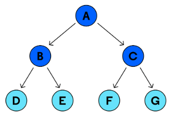

# Class 15

## [Tree Data Structure ](https://codefellows.github.io/common_curriculum/data_structures_and_algorithms/Code_401/class-15/resources/Trees.html)

### What is the Tree?

A tree data structure is a non-linear composed of nodes connected by edges, forming a hierarchical structure. Each node can have multiple children but only one parent, except for the root node which has no parent.

## Common Terminology

- Node - A Tree node is a component which may contain its own values, and references to other nodes.

- Root - The root is the node at the beginning of the tree.

- K - A number that specifies the maximum number of children any node may have in a k-ary tree.

- Left - A reference to one child node, in a binary tree.

- Right - A reference to the other child node, in a binary tree.

- Edge - The edge in a tree is the link between a parent and child node.

- Leaf - A leaf is a node that does not have any children.

- Height - The height of a tree is the number of edges from the root to the furthest leaf.

## Traversals

Traversing a tree allows us to search for a node, print out the contents of a tree, and much more! There are two categories of traversals when it comes to trees:

- Depth First
- Breadth First

### Depth First

Depth First Traversals in trees are a way to visit each node by exploring as far as possible along each branch before backtracking. There are three common strategies:

- Pre-order: root >> left >> right
- In-order: left >> root >> right
- Post-order: left >> right >> root

Given the sample tree above, our traversals would result in different paths:

- Pre-order: A,B,D,E,C,F,G
- In-order: D,B,E,A,F,C,G
- Post-order: D,E,B,F,G,C,A

### Breadth First (Level Order Traversal)

Level Order Traversal technique is defined as a method to traverse a Tree such that all nodes present in the same level from lift to right are traversed completely before traversing the next level.

The main idea of level order traversal is to traverse all the nodes of a lower level before moving to any of the nodes of a higher level. This can be done in any of the following ways: 

- the naive one (finding the height of the tree and traversing each level and printing the nodes of that level)
- efficiently using a queue.

Given the sample tree above, our traversals would result:

- Level Order: 10,5,14,1,7,12,16,6 

## Types of Tree Data Structures؟

Binary tree: In a binary tree, each node can have a maximum of two children linked to it. Some common types of binary trees include full binary trees, complete binary trees, balanced binary trees, and degenerate or pathological binary trees.

Ternary Tree: A Ternary Tree is a tree data structure in which each node has at most three child nodes, usually distinguished as “left”, “mid” and “right”.

K-ary Tree or Generic Tree: Generic trees are a collection of nodes where each node is a data structure that consists of records and a list of references to its children(duplicate references are not allowed). Unlike the linked list, each node stores the address of multiple nodes.